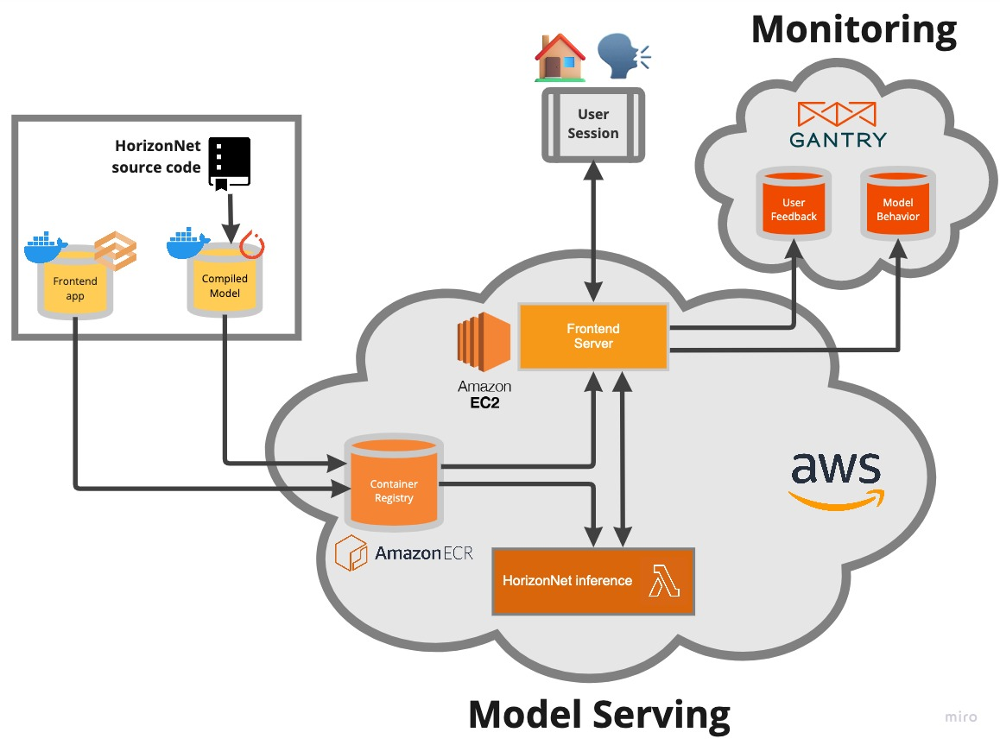

# :house: 3D reconstruction from panoramas (FSDL :pancakes: 2022)

## About 

This repository contains code for a web app which creates 3D reconstructions of rooms from 2D panorama photos. The web app can be accessed HERE, where users can upload panorama images of a room. These images will be passed to a deployment of the [HorizonNet](https://sunset1995.github.io/HorizonNet/) model and will return a 3D reconstruction of the room.

## Architecture



## :wrench: Developer setup

1. Clone the repo and `cd` in.

2. We use `conda` to set the Python and pip versions for the project. Create the conda environment and activate by running:
```bash
$ make conda-update
$ conda activate fsdl-3d-recon
```

3. Install the required packages with pip-tools by running:
```bash
make pip-tools
```

To update packages in the conda environment edit `requirements/dev.in` or `requirements/prod.in` with the desired changes and rerun `make pip-tools`.

4. To set up git hooks for code formatting using `black` and `flake8` run:

```bash
$ pre-commit install
```

To test that this is running correctly run:

```bash
$ pre-commit run --all-files
```

where you should see test results for pre-commit hooks this has worked as expected.
